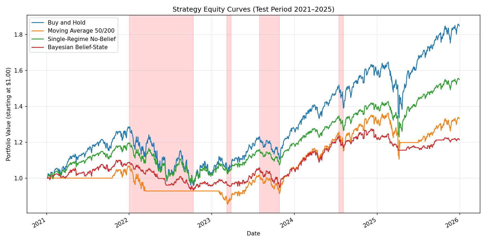
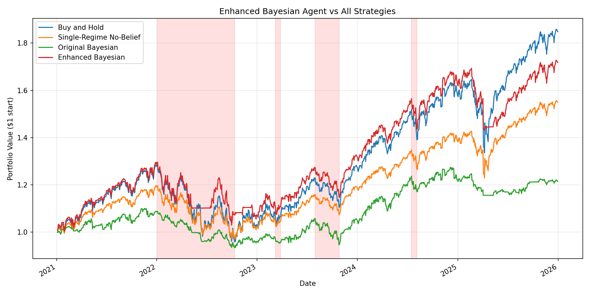
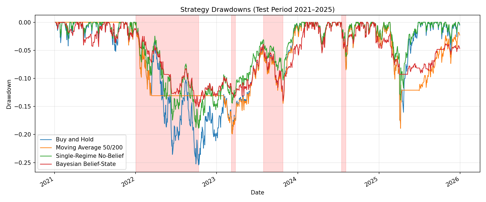
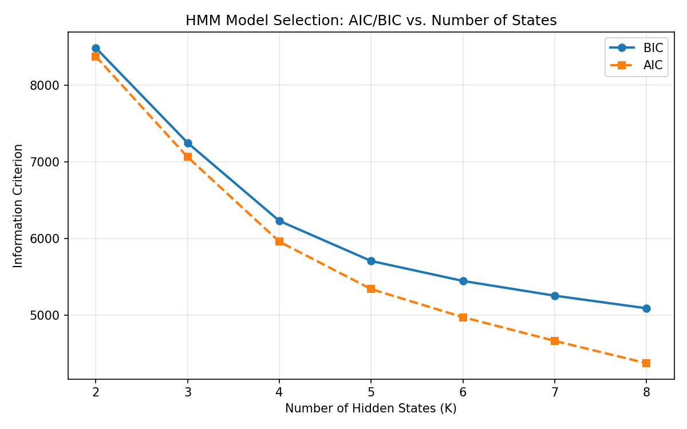

# CSCI 5512 Project: Bayesian Belief-State Trading Agent

This repository contains the final algorithm pipeline and report materials for Group 2's CSCI 5512 final project:

**Bayesian Belief-State Trading Agent for Autonomous Portfolio Management**

The project studies whether a trading agent can make more risk-aware portfolio decisions by explicitly tracking uncertainty over hidden market regimes. The agent learns regimes from S&P 500 data using a Gaussian Hidden Markov Model (HMM), updates daily Bayesian regime beliefs, and converts those beliefs into long-only portfolio weights.

GitHub repository: https://github.com/rowe0137/5512-Final-Stock-Trader

## What Is Included

The submission-ready implementation is in:

```text
belief_state_trader/
```

It includes:

- S&P 500 data loading and preprocessing.
- Buy-and-Hold, Moving Average 50/200, and Single-Regime No-Belief baselines.
- HMM regime estimation with `hmmlearn`.
- Bayesian belief filtering over hidden regimes.
- Belief-conditioned portfolio allocation.
- Transaction-cost-aware backtesting.
- Model selection, ablation studies, calibration checks, and plots.
- `pgmpy` Dynamic Bayesian Network representation check.
- Enhanced bear-defense Bayesian strategy with validation and held-out evaluation.
- Full LaTeX report and compiled PDF.

## Main Project Story

The base Bayesian agent is intentionally conservative. It has lower volatility and lower maximum drawdown than the baselines, but it gives up upside during the mostly bullish 2021-2025 test period.

The enhanced bear-defense strategy improves the practical result by using belief information more selectively. Its final configuration was selected on 2021-2022 validation data and checked on a held-out 2023-2025 period.

| Strategy | Period | Total Return | Sharpe | Sortino | Max Drawdown |
|---|---:|---:|---:|---:|---:|
| Base Bayesian Belief-State | 2021-2025 | 21.57% | 0.432 | 0.561 | -15.11% |
| Enhanced Bear-Defense Bayesian | 2023-2025 held-out | 60.78% | 1.227 | 1.573 | -15.85% |

The final claim is not that the Bayesian strategy always has the highest raw return. The stronger and more defensible claim is that explicit regime beliefs provide a useful framework for risk-aware allocation, downside control, and uncertainty-aware strategy design.

## Report

The final report files are here:

```text
belief_state_trader/reports/belief_state_trader_group2_report.tex
belief_state_trader/reports/belief_state_trader_group2_report.pdf
```

The report explains the project motivation, related work, mathematical formulation, algorithm pipeline, experiments, results, limitations, and ethical considerations.

## Key Figures

The pipeline regenerates the main charts in `belief_state_trader/results/`.

### Main Strategy Equity Curves



### Enhanced Strategy Equity Curves



### Drawdown Comparison



### HMM Model Selection



## Setup

Recommended Python version: Python 3.10 or newer.

From the repository root:

```powershell
python -m venv .venv
.\.venv\Scripts\Activate.ps1
python -m pip install --upgrade pip
python -m pip install -r requirements.txt
```

If a virtual environment is already active, only the final install command is required.

## Run The Full Pipeline

From the implementation folder:

```powershell
cd belief_state_trader
python scripts/run_all.py
```

Optional sanity check:

```powershell
python -m compileall scripts src
```

The full runner writes result CSVs and plots into:

```text
belief_state_trader/results/
```

## Important Files

```text
belief_state_trader/
|-- data/        # train/test S&P 500 CSV files
|-- reports/     # final LaTeX report and compiled PDF
|-- results/     # generated CSVs, fitted model, and plots
|-- scripts/     # numbered runnable pipeline steps
|-- src/         # reusable implementation modules
|-- README.md    # implementation-specific details
```

For a more detailed file-by-file map, see:

```text
belief_state_trader/PROJECT_FILE_MAP.md
```

## Reproducibility Notes

- The HMM is trained on 2015-2020 data.
- The main test period is 2021-2025.
- The enhanced strategy configuration is selected on 2021-2022 validation data.
- The enhanced strategy is checked on held-out 2023-2025 data.
- The `pgmpy` DBN component is used as a structural representation check, not as an independent replacement for the HMM Gaussian filter.

## Submission Hygiene

Generated Python cache files and LaTeX auxiliary files are ignored by `.gitignore`, so the submitted folder stays focused on project code, results, and report materials.
